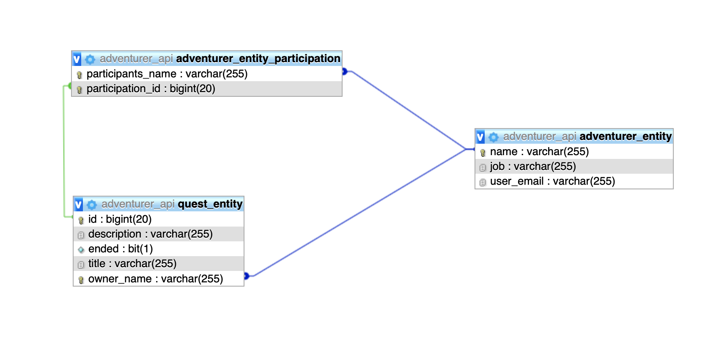
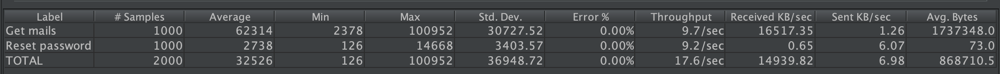
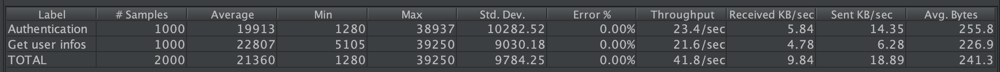
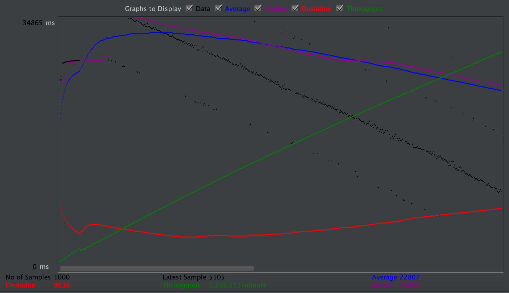
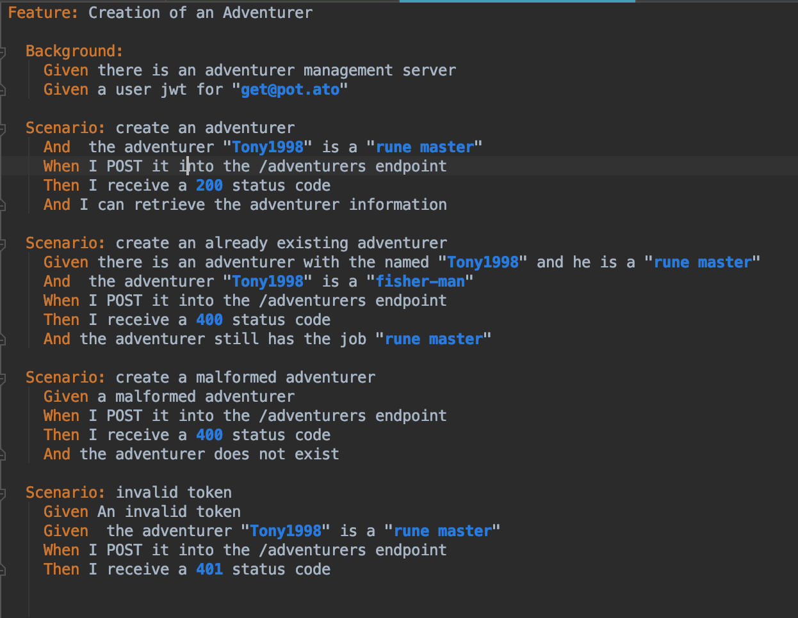

# Teaching-HEIGVD-AMT-2019-Project-Two
Authors: Budry Nohan, Moreno Andres

## Objectives

The objectives of this project is to design, specify, implement and validate **2 RESTful APIs**, using a set of technologies that build upon or complement Java EE standards. Namely, the goal is to use:

* **Spring Boot**, **Spring Data**, **Spring MVC** and **Spring Data** for the implementation of the endpoints and of the persistence;
* **Swagger** (**Open API**) to create a formal documentation of the REST APIs (this formal documentation has to be used in the development cycle);
* JSON Web Tokens (**JWT**) to secure the RESTful endpoints;
* **CucumberJVM** to implement BDD tests.

## Business domain:

For our business, we've decided to implement a adventure game, where adventures can accomplish quests. 

## Docker-Topology

Inside the file we can find 2 different version topology and topology-dev. The first 

### Prod

### Dev

## Swagger 

## Instructions:

`JWT token:` secret

`MyPhp credentials`:  **username**= root  **password**=secret

## Tests

### JMetter

User-Api  reset password request :

User-Api Authentication request:

Adventures-Api 

### Cucumber

In order to test both backends, we've used cucumber for testing the different api. Cucumber is a software tool used by computer programmers that supports behavior-driven development.  

example of  test scenarios used at the adventurer-api.

This tests enable us to test the crud (Create read update and delete) Methods. It will interact with the database. 

## **Known bugs and limitations**

- The delete method is implemented and functional but when the test cucumber are executed the delete method unfortunately cant find the quest. (we couldn't find the issue).

