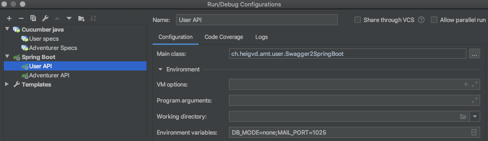
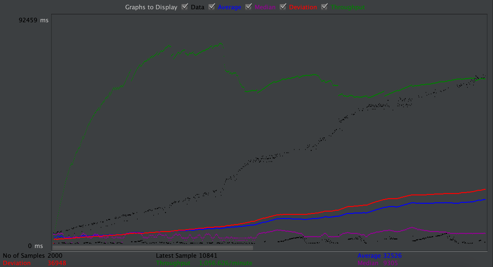

# Teaching-HEIGVD-AMT-2019-Project-Two
Authors: Budry Nohan, Moreno Andres

## Objectives

The objectives of this project is to design, specify, implement and validate **2 RESTful APIs**, using a set of technologies that build upon or complement Java EE standards. Namely, the goal is to use:

* **Spring Boot**, **Spring Data**, **Spring MVC** and **Spring Data** for the implementation of the endpoints and of the persistence;
* **Swagger** (**Open API**) to create a formal documentation of the REST APIs (this formal documentation has to be used in the development cycle);
* JSON Web Tokens (**JWT**) to secure the RESTful endpoints;
* **CucumberJVM** to implement BDD tests.

## Business domain:

For our business, we've decided to implement a adventure game, where adventures can accomplish quests. 

## Docker-Topology

### Prod

The production topology contains everything needed to deploy both apis.

In the `topology` folder there is a `docker-compose.yml` file containing the following services.

- Traefik
- Adventurer API
- User API
- Adventurer Database
- User Database

Traefik serves as e reverse proxy and is the only service that is exposed to the world.

The is a .env file containing the needed configuration for the apis to work, like the mail server information and the JWT secret.

To run the api in production, first move to the `topology` folder.

Run `docker-compose up`  and the apis should be available at `localhost/auth` for the user api and at `localhost/` for the adventurer API.

The SERVER_HOST can be change in the `.env` file if needed.

### Dev

The topology-dev contains everything needed for development.

First there is a script named `up.sh`. This script is used to run the adventurer and user databases, phpmyadmin and a mail server. Run `./up.sh` to start those containers. To remove the current data in the databases do `./up-sh -r`. And to load some default data (around 4 million in total, so can be very long) do `./up -l` (also remoes old data).

Then you can run the apis (only one at a time) from IntelliJ. The api are then available at `localhost:8080/api`.

Phpmy admin is accessible at `localhost:8888`

The mail server is accessible at `localhost:8889`

By default the User API uses the port 2525 for the mail server wihch corresponds to the one needed for the cucumber tests. To connect the api to the mail server from the topology-dev, modify the IntelliJ configuration to add an environement variable.

The variable MAIL_PORT must be set to 1025.

The environement variable DB_MODE is by default set to create-drop wich will create the database when started and then delete it when stopped. This is usefull for cucumber because you may need to start the tests while having an empty database.

If you don't want the data in the database to be removed automatically (when using meter for instance) then set DB_MODE to none and  spring wont touch the database.

# Credentials

`JWT token:` secret

`MyPhp credentials`:  **username**= root  **password**=secret

## Tests

### JMetter

User-Api  reset password request :

User-Api Authentication request:

Adventures-Api 

### Cucumber

In order to test both backends, we've used cucumber for testing the different api. Cucumber is a software tool used by computer programmers that supports behavior-driven development.  

example of  test scenarios used at the adventurer-api.

This tests enable us to test the crud (Create read update and delete) Methods. It will interact with the database. 

In order to run the cucumber tests. We need to up the topology-dev and start the api we want to test from IntelliJ.

Then we can run the cucumber tests from IntelliJ or with `mvn test`. The tests may need a empty database to completely pass.

## **Known bugs and limitations**

- The delete method is implemented and functional but when the test cucumber are executed the delete method unfortunately cant find the quest. (we couldn't find the issue).

